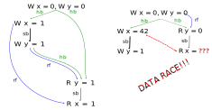
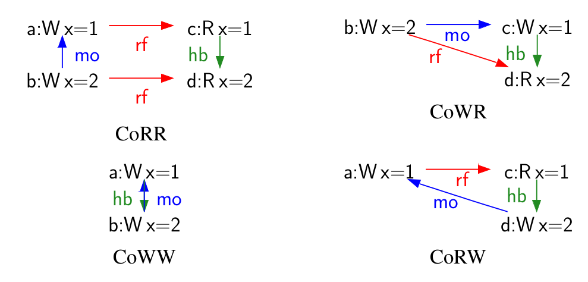

<style>
img[alt~="center"] {
  display: block;
  margin: 0 auto;
}
</style>

# Memory model

---

# Модель памяти
   - Описывает взаимодействия потоков через разделяемую память
   - Ограничивает код, который может генерировать компилятор


---

# Зачем модель памяти?

   - Абстрактная машина C и C++ до 11-го стандарта &mdash; однопоточная
   - В нулевых большинство машин стали многоядерными, и библиотеки позволили использовать многопоточность в рамках одной программы
   - Проблема?
---

# Зачем модель памяти?

   - Проблема!
   - Код исполняется не так, как он написан в программе!
   - Компиляторы и процессоры стараются, чтобы наши программы работали быстро
     - Компилятор переупорядочивает инструкции и заменяет работу с памятью на работу с регистрами
     - Процессор исполняет инструкции спекулятивно и работает с памятью максимально лениво

---

# Пример
   Во что превратится такой код?
```c++
int f(int* x, int* y, int *z) {
    return (*x + 1) + (*y + 1) + (*z + 1);
}
```

---
# Пример

   Во что превратится такой код?
```c++
int f(int* x, int* y, int *z) {
    return (*x + 1) + (*y + 1) + (*z + 1);
}
```

`clang++ -O3 a.cpp && objdump -M intel -d a.out`

```x86asm
mov    eax,DWORD PTR [rdi]
mov    ecx,DWORD PTR [rdx]
add    eax,DWORD PTR [rsi]
lea    eax,[rcx+rax*1]
add    eax,0x3
```

---
# Зачем модель памяти?
   - Код исполняется не так, как он написан в программе!
   - Компиляторы и процессоры стараются, чтобы наши программы работали быстро

Это важно?
Нет, **пока наша программа однопоточная!**
Для нескольких потоков до 11-го стандарта никакой корректности не гарантировалось.

---
# Data race
  - **ячейка памяти** (memory location): объект скалярного типа или максимальная последовательность смежных битовых полей
  - **конфликтующие действия** (conflicting actions): два (или более) доступа к одной ячейке памяти, как минимум одно из которых &mdash; запись
  - **data race**: наличие конфликтующих действий, не связанных между собой отношением *happens-before* (про него будет дальше)

---
# Data race
data race == undefined behaviour


<span style="font-size:70%">Автор картинки: <a href=https://www.fiverr.com/dbeast32>dbeast32</a> </span>

---
# Новая семантика программ
   - Исполнение программы можно представлять как орграф
      - Вершины &mdash; это действия с памятью (плюс ещё кое-что)
      - Рёбра представлют различные **отношения** между действиями с памятью

  

---
# Новая семантика программ
   - Исполнение программы можно представлять как орграф
      - Вершины &mdash; это действия с памятью (плюс ещё кое-что)
      - Рёбра представлют различные **отношения** между действиями с памятью
   - Стандарт накладывает ограничения на то, как могут быть устроены эти отношения

  

---
# Новая семантика 
  - Все возможные графы образуют множество потенциальных исполнений
  - Если хотя бы в одном исполнении data race, поведение всей программы не определено (UB)
  - Иначе может реализоваться любое исполнение.



---
# Атомарные объекты

  - Стандарт вводит новый тип объектов &mdash; атомарные (`std::atomic<T>`)
  - Для таких объектов не бывает data race
  - Плюс действия с такими объектами могут задавать дополнительные ограничения на отношения

---
# Атомарные объекты. Memory order
  
  - С каждым действием с атомарной переменной связан некоторый ярлычок: **memory order** &mdash; что-то вроде "силы" операции.
  - В коде это члены енума `std::memory_order`. Основные:
    - `std::memory_order_seq_cst`
    - `std::memory_order_release` / `std::memory_order_acquire`
    - `std::memory_order_relaxed`

---
# Отношение *sequenced-before* (a.k.a. *program order*)
  *Sequenced-before* &mdash; отношение полного порядка (total order) между всеми действиями, исполняемыми одним потоком.

  

---
# Отношение *reads-from*
  Отношение *reads-from* связывает каждую операцию чтения с той операцией записи, чьё значение вернёт данная операция чтения.

  

---
# Отношение *modification-order*
 Отношение *modification-order* для каждой атомарной переменной является отношением полного порядка для всех операций записи в неё. 

 

---
# Отношение *sc*
 Отношение *sc* является отношением полного порядка между всеми *seq_cst*-действиями с любыми переменными.


---
# Отношение *synchronizes-with*
 Отношение связывает действия, **синхронизирующиеся** друг с другом:
   - Создание треда и первая операция в нём
   - Последняя операция в треде и его join
   - Отпускание мьютекса и соответствующий ему захват
   - *release*-запись и соответствующее ей *acquire*-чтение (`seq_cst`-действия также относятся сюда)

---

# Отношение *synchronizes-with*


---
# Отношение *happens-before*
 Отношение *happens-before* &mdash; это транзитивно замкнутое объединение *synchronizes-with* и *sequenced-before*.

 

---
# Пример ограничения: coherence
**Запрещены** следующие фрагменты в потенциальных исполнениях:



---
# Пример ограничения: *sc*-порядок
 - *sc*-порядок должен быть согласован с *happens-before* и *modification-order*
 - `seq_cst`-чтение обязано прочитать значение из предыдущей (в порядке *sc*) записи

---
# Ещё про `std::atomic<T>`
```c++
static constexpr bool is_always_lock_free = ...;
bool is_lock_free() const noexcept;

T load(memory_order = memory_order_seq_cst) const noexcept;
operator T() const noexcept;
void store(T, memory_order = memory_order_seq_cst) noexcept;

T exchange(T, memory_order = memory_order_seq_cst) noexcept;
bool compare_exchange_weak(T&, T, memory_order = memory_order_seq_cst) noexcept;
bool compare_exchange_strong(T&, T, memory_order = memory_order_seq_cst) noexcept;
```

---
# Операция Compare-And-Swap (CAS)

```c++
bool compare_exchange_strong(T& expected, T desired) {
    if (*this == expected) {
        *this = desired;
        return true;
    } else {
        expected = *this;
        return false;
    }
}
```

---
# Ещё про `std::atomic<T>`
Для целочисленных типов, типов с плавающей точкой и указателей у `atomic<T>` есть методы `fetch_add` и `fetch_sub`.

```c++
T fetch_add(TDiff, memory_order = memory_order_seq_cst) noexcept;
T fetch_sub(TDiff, memory_order = memory_order_seq_cst) noexcept;
```

Также бывают операторы `++`, `--`, `+=`, `-=`, они эквивалентны соответствующему вызову `fetch_...`.

---
# Relaxed memory order
 - Не создаёт *happens-before*-рёбер
 - Гарантирует атомарность лишь для действий с данной переменной
 - Нельзя использовать для синхронизации
 - Для чего можно?

---
# Relaxed memory order. Счётчик
Иногда годится счётчик без немедленной синхронизации (профайлинг, бенчмаркинг).
 - Можно (и нужно) использовать `fetch_add(1, memory_order_relaxed)`
 - В качестве упражения сделаем через `compare_exchange`

```c++
auto old = c.load(memory_order_relaxed);
do {
    auto success = c.compare_exchange_weak(
        old,     // old is updated here in case of failure
        old + 1,
        memory_order_relaxed);
} while (!success);
```

---
```c++
auto old = c.load(memory_order_relaxed);
do {
    auto success = c.compare_exchange_weak(
        old,     // old is updated here in case of failure
        old + 1,
        memory_order_relaxed);
} while (!success);
```


---
# Как нельзя использовать relaxed
```c++
atomic<bool> locked;

void lock() {
    while(locked.exchange(true, memory_order_relaxed)) {}
}

void unlock() {
    locked.store(false, memory_order_relaxed);
}
```

---
# Release-acquire sematics
  - Проводим *happens-before*-ребро из *release*-записи в *acquire*-чтение
  - Можно использовать для синхронизации доступа к другим (даже неатомарным) переменным


---
# Release-acquire sematics
  - Проводим *happens-before*-ребро из *release*-записи в *acquire*-чтение
  - При этом чтение не обязано вернуть значение из соответствующей *release*-записи!


---
# Release-acquire sematics
**Важно:** синхронизируются конкретные доступы к памяти в исполнении, а не строчки в коде!
```c++
/* Thread 1 */                       | /* Thread 2 */
x = 42;                              | y.load(memory_order_acquire);
y.store(true, memory_order_release); | auto my_x = x;
```


---
# Spinlock

```c++
atomic<bool> locked;

void lock() {
    while(locked.exchange(true, memory_order_acq_rel)) {}
}

void unlock() {
    locked.store(false, memory_order_release);
}
```
---
# Проблемы release-acquire
  - Release-acquire семантика предоставляет довольно сильные гарантии, достаточные для большинства алгоритмов.
  - Нужно ли что-то сильнее?

---
# Проблемы release-acquire. Dekker's algorithm
```c++
atomic<bool> f1, f2;
```
```c++
/* Thread 1 */                        | /* Thread 2 */
f1.store(true, memory_order_release); | f2.store(true, memory_order_release);
if (!f2.load(memory_order_acquire)) { | if (!f1.load(memory_order_acquire)) {
    /* Critical section */            |     /* Critical section */
} else { /* Process contention */ }   | } else { /* Process contention */ }
```


---
# Dekker's algorithm & sequential consistency
```c++
atomic<bool> f1, f2;
```

```c++
/* Thread 1 */                      
f1.store(true, memory_order_seq_cst);            
if (!f2.load(memory_order_seq_cst)) {            
    /* Critical section */          
} else { /* Process contention */ } 

/* Thread 2 */
f2.store(true, memory_order_seq_cst);
if (!f1.load(memory_order_seq_cst)) {  
    /* Critical section */
} else { /* Process contention */ }
```


---
# Полезные ссылки
1. [Наглядная презентация с Meeting C++ 2014](https://www.think-cell.com/en/career/talks/pdf/think-cell_talk_memorymodel.pdf)
1. [Простое (но неглубокое) введение в формальную модель памяти](http://user.it.uu.se/~tjawe125/talks/cpp-memory-model-overview-and-formalization.pdf)
1. [Mathematizing C++ Concurrency (cуровая статья про формализацию)](https://www.cl.cam.ac.uk/~pes20/cpp/popl085ap-sewell.pdf)
1. [x86-TSO: A Rigorous and Usable Programmer’s Model for
x86 Multiprocessors (модель памяти x86)](https://www.cl.cam.ac.uk/~pes20/weakmemory/cacm.pdf)
1. [Подборка материалов про толкование модели памяти C++](https://hboehm.info/c++mm/)
